# PRISME — Cadrage technique

> **Nature de ce document.** Il cadre un système **déjà construit à ~85 %**, pas un projet vierge.
> Chaque élément porte donc son état réel : ✅ implémenté, 🟡 partiel, ⬜ absent. Les choix passés y
> sont expliqués et, quand ils sont contestables, contestés. Il sert de référentiel d'architecture
> pour la suite du développement et de matière pour le rapport de PFE.
>
> Sources : code du dépôt au 25 septembre 2026, `CLAUDE.md`, `PRISME_Note_de_Cadrage (2).md`.

---

## 0. Incohérences relevées dans la demande de cadrage

Avant tout le reste, sept points de la demande ne correspondent pas à l'état ou aux principes du
projet. Les ignorer produirait un cadrage joli mais faux.

| # | Hypothèse de la demande | Réalité PRISME | Décision proposée |
|---|---|---|---|
| 1 | « Identifier où OR-Tools / CP-SAT pourrait être utilisé » | **CP-SAT a été retiré du projet.** `ortools` est explicitement rejeté par l'allowlist AST ; les solveurs générés sont **toujours** des heuristiques, jugées à 10 % de tolérance | Assumer l'absence de moteur exact **en production**, mais voir §13.4 : réintroduire un solveur exact comme *oracle de validation hors ligne* est le seul usage qui garde du sens |
| 2 | « Ne code rien pour l'instant » | Étapes 1 à 8 sur 9 sont codées, testées, avec frontend | Ce document est un **rétro-cadrage** : il fige l'architecture réelle et liste ce qui reste |
| 3 | « Agent d'ordonnancement » dans la liste d'agents | L'ordonnancement n'est **pas** un agent : c'est du code Python figé, exécuté sans IA | Ne jamais créer cet agent — il violerait le principe fondateur (§1) |
| 4 | « Le solveur doit rester interchangeable » | Le solveur n'est pas une bibliothèque qu'on branche : il est **écrit par l'IA pour une instance** | L'interchangeabilité porte sur l'**algorithme choisi** (7 familles) et sur la **régénération**, pas sur un moteur tiers |
| 5 | « Les dates calendaires ne font pas partie du cœur » | Vrai pour le DSL (instants relatifs), mais un **calendrier d'heures ouvrées** existe (`dsl/calendrier.py`) | Nuance à assumer : le DSL reste relatif, l'ancrage calendaire est fourni **à l'exécution**, jamais stocké dans l'instance |
| 6 | « Éventuellement un BPMN décrivant le processus » | Aucun support BPMN, et le périmètre n'a jamais été confirmé | **Hors périmètre** tant qu'un besoin client réel n'est pas exprimé (§23) |
| 7 | Deux agents distincts : « modélisation » et « génération/adaptation du modèle » | Un seul enchaînement Analyste → Architecte → Développeur | Ne pas dédoubler : la responsabilité serait la même, avec un appel LLM en plus |

Deux zones réellement floues, à trancher par toi (voir questions P0 en fin de document) :

- **Le rôle exact de la réoptimisation** : aujourd'hui, elle est *proposée* à un humain, jamais
  déclenchée seule. Une réoptimisation automatique changerait le principe « human-in-the-loop ».
- **La portée du multi-client** : le code est multi-tenant, mais aucune politique de quota,
  d'isolation des coûts LLM ou de rétention des données n'est définie.

---

## 1. Vision du système

**PRISME permet à un atelier industriel d'obtenir un ordonnancement fait sur mesure pour lui, sans
payer un progiciel générique ni des mois de développement spécifique.**

Le pari technique tient en une phrase : **l'IA écrit le code du solveur une seule fois, hors ligne,
sous contrôle de tests déterministes ; ensuite c'est du Python figé qui tourne tous les jours.**

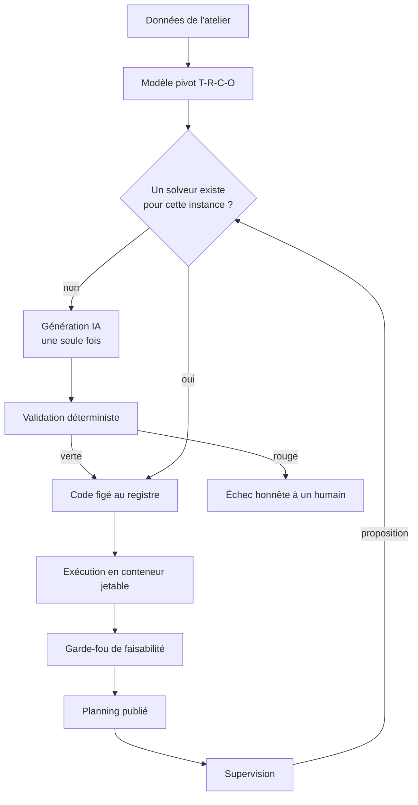

Trois propriétés non négociables, qui découlent de cette vision :

1. **Générer une fois, réexécuter souvent.** Le coût et l'imprévisibilité de l'IA sont concentrés
   sur un évènement rare. Le quotidien est du code ordinaire, figé, tracé.
2. **Le code persiste, l'exécution est jetable.** Le solveur vit dans un registre ; le conteneur
   qui l'exécute naît et meurt à chaque planning.
3. **L'humain tranche à chaque risque.** Le système signale et propose ; il n'agit jamais seul sur
   une décision qui engage l'atelier.

---

## 2. Périmètre fonctionnel

### 2.1 Vue d'ensemble par module

| Module | Rôle | État | Code |
|---|---|---|---|
| M1 — Ingestion & connecteurs | Faire entrer les données de l'atelier | ✅ | `adapters/`, `api/routes/adapters.py`, `ingestion.py` |
| M2 — Modèle pivot T-R-C-O | Représenter le problème de façon typée et validable | ✅ | `dsl/` |
| M3 — Validation d'entrée | Refuser toute instance incohérente | ✅ | `api/input_validation/`, `dsl/schema/instance.py` |
| M4 — Génération du solveur | Écrire, tester, réparer, figer le code | ✅ | `generation/` |
| M5 — Registre des solveurs | Conserver et vérifier le code figé | ✅ | `solver_store/` |
| M6 — Exécution isolée | Exécuter le code généré sans risque | ✅ | `sandbox/` |
| M7 — Validation de sortie | Vérifier le planning produit | ✅ | `validation_engine/feasibility_checker.py` |
| M8 — Commandes & gammes | Faire entrer la demande client | ✅ | `adapters/gamme_derivation.py`, `commande_derivation.py` |
| M9 — Planning & Gantt | Restituer et ajuster le planning | ✅ | `api/routes/planning.py`, frontend |
| M10 — Supervision | Comparer prévu et réel, proposer | ✅ | `supervision/` |
| M11 — Diagnostic d'échec | Attribuer la cause d'un mauvais planning | 🟡 | `diagnostics/` |
| M12 — Scénarios / what-if | Comparer des variantes d'instance | ✅ | `api/comparaison_scenarios.py` |
| M13 — Estimation de durées | Combler les durées manquantes | 🟡 | `estimation/` |
| M14 — Audit & traçabilité | Justifier a posteriori un planning | ✅ | `api/routes/audit.py` |
| M15 — Multi-tenant & sécurité | Isoler les clients | 🟡 | `api/routes/auth.py`, `clients.py`, `api_keys.py` |
| M16 — Réoptimisation | Replanifier sans tout casser | 🟡 | horizon gelé dans `sandbox/runner.py` |
| M17 — Observabilité | Voir où passent le temps et l'argent | ✅ | `MesureAppelLLM`, LangSmith |

### 2.2 Fiches fonctionnelles (les douze fonctions structurantes)

Format : objectif · entrées · sorties · acteurs · règles métier · dépendances.

**F1 — Ingérer des données structurées** ✅
Objectif : produire une instance T-R-C-O validée à partir d'un CSV, d'un JSON ou d'un tableur.
Entrées : fichier + unité de temps + client. Sorties : `instance_id`, avertissements.
Acteurs : planificateur. Règles : toute tâche doit avoir au moins une compatibilité
ressource-tâche ; les durées manquantes peuvent être dérivées des compétences, jamais inventées ;
toute valeur estimée par ML remonte en avertissement explicite. Dépend de M2, M3.

**F2 — Ingérer des données non structurées** ✅
Objectif : traduire un export ERP hétérogène via l'agent de compréhension.
Entrées : données brutes (texte, JSON, dump). Sorties : instance candidate + avertissements +
justifications citant le champ source. Règles : la compatibilité ressource-tâche ne se déduit
**jamais** d'un simple historique d'affectation ; en cas de doute, omettre et signaler, quitte à
faire rejeter l'instance. Dépend de M1, M3.

**F3 — Explorer une base de données externe** ✅
Objectif : découvrir le schéma d'une base client en lecture seule et proposer un mapping.
Entrées : DSN lecture seule. Sorties : description du schéma + proposition. Règles : aucune
écriture, jamais ; le mapping proposé est relu par un humain. Dépend de M1.

**F4 — Générer un solveur** ✅
Objectif : produire le code d'un solveur propre à une instance.
Entrées : `instance_id`. Sorties : `id_solveur` + historique complet des tentatives.
Règles : aucun solveur n'est enregistré si la cascade n'est pas verte ; la boucle est bornée à
10 tentatives, puis échec honnête. Dépend de M2, M4, M5, M6.

**F5 — Exécuter un planning** ✅
Objectif : produire un planning à partir de données à jour.
Entrées : `instance_id`, éventuellement planning précédent + horizon gelé.
Sorties : planning + verdict de faisabilité. Règles : un solveur ne sert que **son** instance
(exception documentée : un scénario réutilise le solveur de son instance de base) ; le garde-fou
tourne côté hôte, jamais dans le conteneur. Dépend de M5, M6, M7.

**F6 — Enregistrer une commande** ✅
Objectif : faire entrer la demande client dans l'instance.
Entrées : gammes + quantités + durées + date limite. Sorties : tâches, précédences, compétences,
échéance dérivée. Règles : une échéance explicite l'emporte sur une échéance dérivée ; la plus
proche gagne si une tâche appartient à plusieurs commandes. Dépend de M2, M8.

**F7 — Consulter et ajuster un planning** ✅
Objectif : voir le Gantt et déplacer une opération à la main.
Entrées : `execution_id`, ajustements. Sorties : planning ajusté ou liste de violations.
Règles : un ajustement illégal n'est jamais persisté. Dépend de M7, M9.

**F8 — Superviser** ✅
Objectif : détecter ce qui cloche et proposer une action à un humain.
Entrées : instances, solveurs, historique d'exécutions, plannings. Sorties : propositions
priorisées. Règles : le système propose, l'humain décide ; aucun fait n'est inventé. Dépend de M10.

**F9 — Diagnostiquer un mauvais planning** 🟡
Objectif : attribuer la cause dans un ordre fixe — faute de code, donnée corrompue, spécification
erronée. Entrées : `execution_id`. Sorties : cause attribuée. Règles : ne jamais « améliorer » du
code sain pour compenser une mauvaise donnée. Dépend de M7, M11.

**F10 — Comparer des scénarios** ✅
Objectif : évaluer des variantes what-if côte à côte.
Entrées : instance de base + variantes. Sorties : métriques comparées. Règles : un scénario partage
l'atelier de sa base ; il réutilise son solveur tant que la structure de contraintes correspond.

**F11 — Auditer** ✅
Objectif : montrer le code exact qui a produit un planning donné.
Entrées : `execution_id` ou `id_solveur`. Sorties : code source, documentation, empreinte.
Règles : canal séparé de l'opérationnel, sur demande explicite.

**F12 — Observer le coût et la latence** ✅
Objectif : voir où passe le temps d'une génération et pourquoi.
Sorties : par appel au modèle — durée, attente, tokens, part de réflexion, refus, cause dominante.

---

## 3. Périmètre technique

| Couche | Technologie | Justification |
|---|---|---|
| Modèle pivot | Pydantic v2 | Validation déclarative, union discriminée, `extra="forbid"` — c'est le garde-fou |
| API | FastAPI | Typage partagé avec Pydantic, SSE natif, documentation automatique |
| Orchestration d'agents | LangGraph | Graphe d'états explicite, parallélisme, flux d'évènements — plutôt qu'un enchaînement de fonctions |
| Accès LLM | LangChain + API Kimi (repli OpenRouter) | Timeout réel par appel, sortie structurée, un seul fournisseur réellement exploité |
| Persistance | PostgreSQL | Une table par entité ; les artefacts de code restent sur disque |
| Isolation | Docker | Conteneur jetable, sans réseau, disque en lecture seule, non-root, 1 vCPU, 512 Mo, 30 s |
| Estimation | scikit-learn | Complément optionnel, jamais une source de vérité |
| Observabilité | LangSmith + mesures internes | Traces d'appels LLM, latence visible dans l'application |
| Frontend | TanStack Start + React + Tailwind | Hors périmètre de ce document |

**Solveur : aucun moteur tiers.** Le code généré n'importe que la bibliothèque standard restreinte
(`random`, `math`, `heapq`, `itertools`, `bisect`, `functools`, `copy`, `collections`) et `dsl.schema`.
C'est un choix de sécurité autant que d'architecture (§13).

---

## 4. Acteurs

| Acteur | Ce qu'il fait | Ce qu'il ne fait jamais |
|---|---|---|
| Planificateur d'atelier | Ingère des données, lance des exécutions, ajuste le Gantt, tranche les propositions | Écrire du code, régler le LLM |
| Responsable de production | Consulte les plannings, les retards, les commandes | Modifier une instance |
| Intégrateur / IT client | Branche un connecteur, fournit un accès lecture seule | Toucher au cœur métier |
| Administrateur PRISME | Gère clients, clés API, quotas | Décider à la place d'un planificateur |
| Auditeur | Consulte le code figé et sa documentation | Modifier quoi que ce soit |
| **Agents IA** | Comprendre, proposer, écrire du code candidat, expliquer | **Valider leur propre sortie**, publier un planning, décider |

---

## 5. Cas d'utilisation

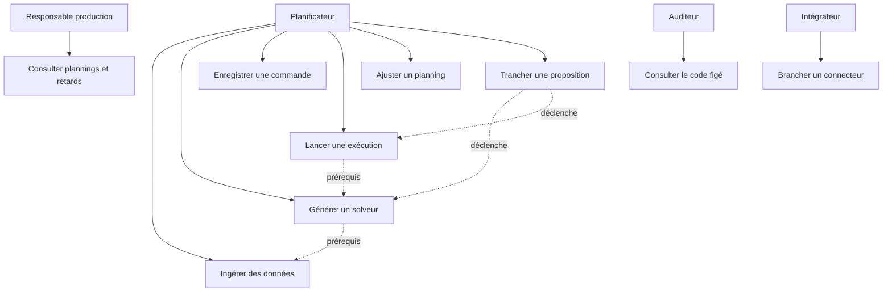

---

## 6. Workflow global

Le workflow proposé dans la demande est correct dans son esprit mais fusionne deux temps très
différents. Le voici corrigé : **la génération est un évènement rare, l'exécution est quotidienne.**

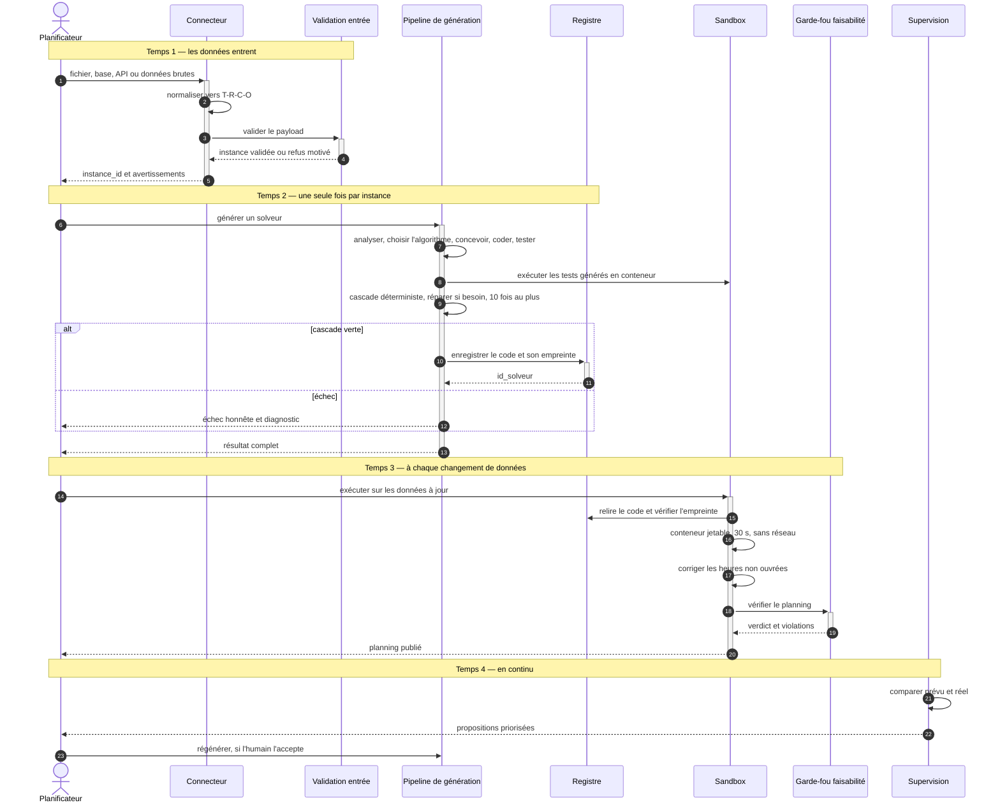

**Ce que le workflow de la demande omettait** : la vérification d'empreinte à la relecture, la
correction des heures non ouvrées après solveur, la distinction entre validation d'entrée et
garde-fou de sortie, et le fait que la réoptimisation passe par une décision humaine.

---

## 7. Architecture logique

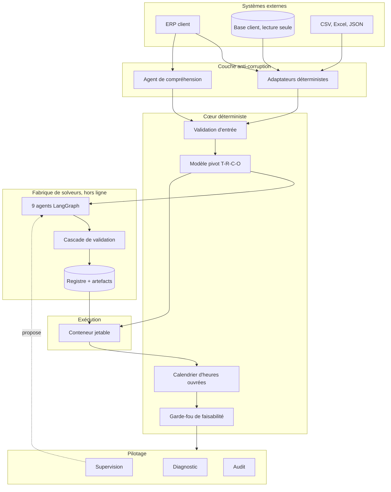

Règle de dépendance : **le cœur déterministe ne dépend d'aucun module IA.** `dsl/`,
`validation_engine/` et `sandbox/` n'importent jamais `generation/agents/`. L'inverse est vrai.

---

## 8. Architecture multi-agents

### 8.1 Quels agents sont réellement nécessaires

Onze agents existent, répartis en trois familles. La liste proposée dans la demande en contenait
huit, dont deux à supprimer et un à dédoubler différemment.

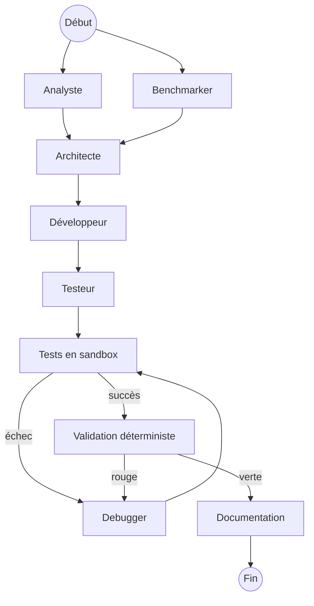

### 8.2 Fiches d'agents

**Agent Analyste** ✅
Rôle : traduire la mission en spécification technique. Entrées : types de contraintes et
d'objectifs présents, jamais les valeurs. Traitement : LLM, sortie structurée. Sorties : entrées,
sorties, contraintes à couvrir. Outils : recherche d'instances similaires au registre, purement
informative. Mémoire : aucune. Activation : début de génération. Appelle : rien.
Risques : spécifier une contrainte absente de l'instance. Validation : l'Architecte et la cascade
en aval.

**Agent Benchmarker** ✅
Rôle : choisir l'algorithme et ses paramètres. Entrées : taille, flexibilité, densité, types de
contraintes et d'objectifs. Traitement : LLM contraint à sept valeurs possibles (`Literal`).
Sorties : algorithme, raison, paramètres, alternatives. Outils : recherche web, facultative.
Risques : choisir un algorithme qui ne tient pas dans 30 s ou qui reste au-dessus de 10 % de
l'optimum. Validation : la cascade tranche.

**Agent Architecte** ✅
Rôle : planifier la structure interne du module. Entrées : spécification + algorithme.
Sorties : représentation de la solution, contraintes du modèle, objectif, fonctions internes.
Outils : catalogue documentaire fermé. Risques : plan incohérent avec l'algorithme imposé.

**Agent Développeur** ✅
Rôle : écrire le module Python. Entrées : mission + plan technique. Sorties : code source.
Risques : import interdit, décodeur qui viole une contrainte dure, réponse coupée par la limite de
tokens. Validation : allowlist AST, puis exécution, puis cascade.

**Agent Testeur** ✅
Rôle : écrire des tests pytest complémentaires. Entrées : code + types de contraintes présents +
algorithme. Sorties : module de tests. Risques : tester un comportement hors périmètre.
Validation : exécutés pour de vrai en conteneur.

**Agent Debugger** ✅
Rôle : corriger le code, ou les tests quand ce sont eux qui ont tort. Entrées : code, problème,
plan, algorithme, historique de ses propres tentatives dans cette génération. Mémoire : bornée à
la génération en cours, jamais persistée. Risques : rejouer un correctif déjà en échec, changer
d'algorithme.

**Agent Documentation** ✅
Rôle : rédiger le résumé destiné au canal d'audit. Meilleur effort : son échec ne perd jamais un
solveur validé.

**Agent Reviewer** 🟡 désactivé
Relecture LLM du code, non câblée : son signal est redondant avec des tests réellement exécutés.
Conservé, recâblable en deux lignes.

**Agent de compréhension** ✅
Rôle : proposer une traduction T-R-C-O de données brutes. Sorties : instance candidate,
avertissements, justifications. Risque majeur : **fabriquer une compatibilité plausible**. Contre-mesure :
règle absolue dans le prompt + validation déterministe en aval + justification exigée par contrainte.

**Agent d'exploration de base** ✅
Rôle : décrire un schéma inconnu et proposer un mapping. Accès strictement en lecture seule.

**Agent de supervision** ✅
Rôle : habiller de langage naturel des faits détectés de façon déterministe, et les prioriser.
Règle : il n'invente aucun fait et n'omet aucune référence fournie.

### 8.3 Agents à ne pas créer

| Agent proposé | Pourquoi non |
|---|---|
| Agent d'ordonnancement | L'ordonnancement est du code figé — un agent violerait le principe fondateur |
| Agent de normalisation | La normalisation doit être déterministe et testable : c'est un adaptateur, pas un agent |
| Agent de modélisation **et** agent de génération du modèle | Même responsabilité, deux appels LLM : Analyste + Architecte suffisent |
| Agent d'analyse des résultats | Le verdict vient du garde-fou déterministe ; l'explication peut rester une fonction du LLM de supervision |

---

## 9. Modèle pivot

### 9.1 Pourquoi un modèle pivot est indispensable

Trois raisons, dans l'ordre d'importance :

1. **Il borne ce que l'IA peut écrire.** Un vocabulaire fini et typé limite la surface de
   génération : c'est un contrôle de sécurité avant d'être un choix de modélisation.
2. **Il découple les connecteurs du solveur.** N connecteurs et M algorithmes ne font pas N × M
   intégrations, mais N + M.
3. **Il rend la validation possible.** On ne peut vérifier un planning que contre une définition
   non ambiguë du problème.

### 9.2 Les quatre axes

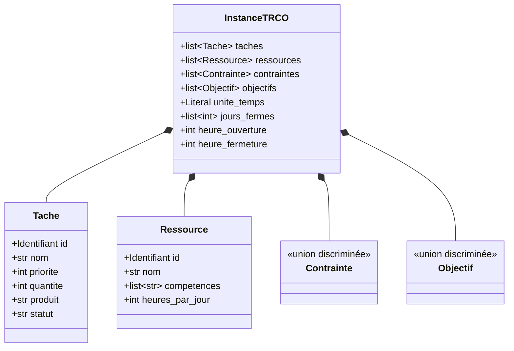

**Point de modélisation clé, souvent mal compris** : la durée n'est pas un champ de `Tache`. Elle
vit sur la compatibilité ressource-tâche, parce qu'en FJSP flexible une opération ne dure pas la
même chose selon la machine. De même, précédences et compétences sont des **contraintes**, pas des
attributs.

### 9.3 Les onze types de contraintes

| Type | Sémantique | Lu par le solveur |
|---|---|---|
| `precedence` | `avant` finit avant que `apres` commence | oui |
| `compatibilite_ressource_tache` | couple faisable + durée | oui, obligatoire |
| `echeance` | fin au plus tard à un instant relatif | oui, contrainte dure |
| `competence_requise` | compétence exigée par la tâche | non : déjà garantie en amont |
| `capacite` | N opérations simultanées sur une ressource | oui |
| `incompatibilite` | deux tâches jamais sur la même ressource | oui |
| `disponibilite_ressource` | instants et motif hebdomadaire d'indisponibilité | oui |
| `taille_lot` | bornes sur la quantité | non : vérification statique |
| `changement_serie` | temps de réglage dirigé entre deux tâches | oui |
| `declaration_materiau` | existence d'une matière et son stock initial | oui |
| `consommation_matiere` | prélèvement d'une tâche sur ce stock | oui, contrainte dure |

### 9.4 Les cinq objectifs paramétrables

`minimiser_makespan`, `equilibrer_charge` (écart max, variance ou Gini), `minimiser_retards`,
`maximiser_utilisation`, `minimiser_changements` — chacun porte un poids ; plusieurs objectifs se
combinent par somme pondérée dans la fonction de coût.

### 9.5 Ce que le modèle pivot ne contient délibérément pas

| Absent | Pourquoi | Où c'est traité |
|---|---|---|
| Dates calendaires | Un solveur raisonne en instants relatifs ; les dates sont une affaire d'affichage et d'intégration | Connecteurs en amont, ancrage à l'exécution |
| Commandes, clients, gammes | Ce sont des concepts d'intégration, pas d'ordonnancement | Dérivés en `echeance`, `precedence`, tâches |
| Coûts, marges, stocks multi-sites | Hors FJSP | Hors périmètre |
| Nomenclature / BOM | Non confirmé, v1 exclue | Report explicite |

---

## 10. Modèle de données

Dix tables, une par entité, plus les artefacts de code sur disque.

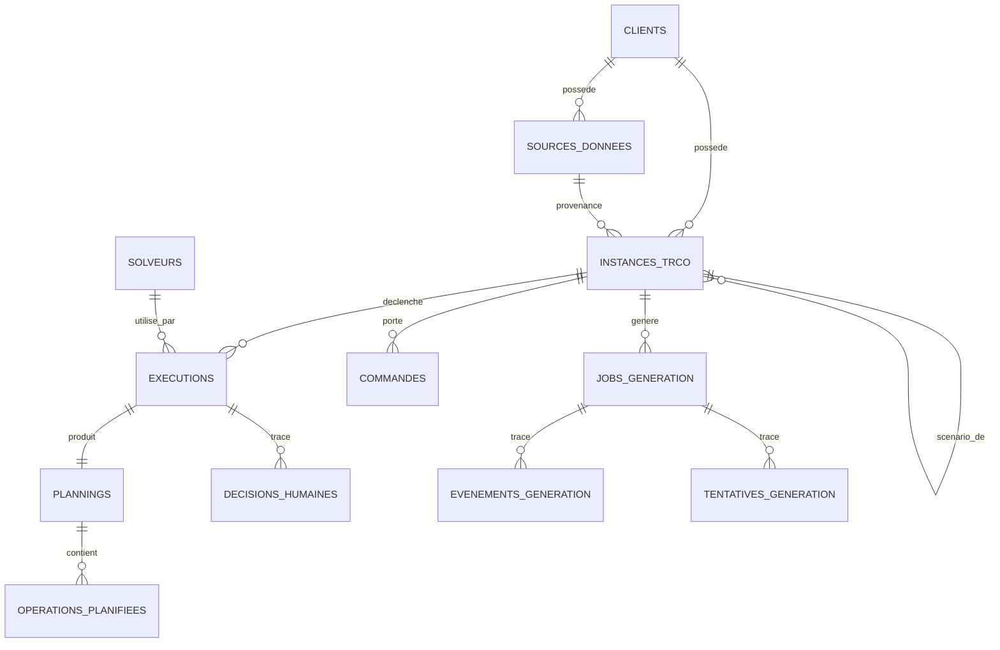

Deux règles structurantes :

- **L'instance est l'entité première.** Elle porte son propre historique d'exécutions ; sa
  suppression cascade sur ses plannings et décisions.
- **La source de données n'est que de la provenance.** Elle ne pointe jamais vers une instance
  « courante » et n'empêche aucune suppression.

---

## 11. DSL ou représentation du problème

Quatre approches étaient possibles. Comparaison honnête :

| Approche | Avantage | Inconvénient rédhibitoire |
|---|---|---|
| DSL fixe | Vérifiable, bornant pour l'IA | Chaque nouveau besoin métier demande une évolution du schéma |
| DSL configurable par le client | Souplesse maximale | Plus rien n'est vérifiable ni généralisable : le garde-fou disparaît |
| Modèle pivot structuré, extensible par types | Vérifiable **et** extensible sans toucher l'existant | Demande de la discipline sur l'ajout de types |
| Représentation générée par un agent | Adaptation totale | Une hallucination devient une règle métier : inacceptable |

**Recommandation, déjà appliquée : le modèle pivot structuré (approche 3).** L'union discriminée
permet d'ajouter un type de contrainte sans toucher aux dix autres, et chaque ajout se propage
mécaniquement : schéma, vérificateur de faisabilité, prompts de génération, interface.

L'adaptabilité aux contextes industriels ne vient donc **pas** d'un DSL mou, mais de deux leviers :
la traduction sémantique en amont (agent de compréhension, connecteurs) et la génération de code en
aval (un solveur par atelier).

---

## 12. Architecture des connecteurs

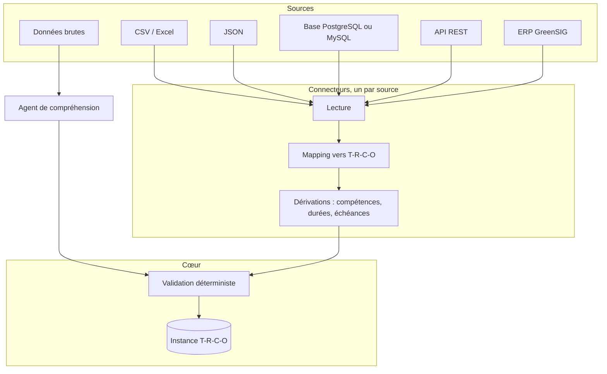

**Contrat d'un connecteur** — c'est ce qui permet d'en ajouter un sans toucher au cœur :

```python
class ResultatTraduction(NamedTuple):
    instance: InstanceTRCO          # déjà valide, sinon exception
    avertissements: tuple[str, ...] # tout ce qu'un humain doit vérifier
```

Un connecteur ne fait que trois choses : lire, mapper, signaler. Il ne décide jamais, ne persiste
rien, et ne connaît ni le solveur ni les agents. État : ✅ pour CSV, JSON, tableur, base, ERP de
référence, GreenSIG ; ⬜ pour MySQL et SQL Server (le patron existe, l'implémentation non).

**Mapping automatique** : trois niveaux, du plus sûr au moins sûr — correspondance exacte de noms
(déterministe), dérivation par règles (compétences → compatibilités, commande → échéance), puis
proposition sémantique par LLM, toujours relue par un humain.

---

## 13. Architecture du solveur

### 13.1 Ce que le solveur reçoit et rend

```python
def resoudre(
    instance: InstanceTRCO,
    planning_precedent: Planning | None = None,
    horizon_gele_jours: int = 0,
) -> Planning | None: ...
```

Une seule fonction publique, un seul module. Entrée : l'instance complète. Sortie : un planning, ou
`None` si l'instance est jugée infaisable. Les deux paramètres optionnels servent la replanification
à horizon glissant et gardent la compatibilité avec les solveurs déjà figés.

### 13.2 Comment le problème est « généré »

Il ne l'est pas au sens classique : il n'y a pas de traduction vers un format de solveur. Le
**code du solveur lui-même** est généré une fois, puis figé. Les contraintes sont donc encodées
dans du Python lisible, relisible en audit.

### 13.3 Comment il est exécuté

Conteneur jetable, image dédiée, sans réseau, disque en lecture seule, non-root, 1 vCPU, 512 Mo,
64 processus, 30 secondes, tué au dépassement. Le code est relu depuis le registre et son empreinte
SHA-256 revérifiée avant chaque exécution.

### 13.4 Le débat CP-SAT, à trancher explicitement

**Situation** : CP-SAT a été retiré. Conséquences mesurables :

| Conséquence | Portée |
|---|---|
| Plus aucune garantie d'optimalité | Les plannings sont « bons », jamais prouvés optimaux |
| Plus de preuve d'infaisabilité | Un `None` signifie « pas trouvé », pas « impossible » |
| Tolérance de 10 % sur le banc | La cascade ne peut plus exiger l'optimum exact |
| Génération plus simple | Un décodeur constructif est plus facile à écrire qu'un modèle CP-SAT correct |

**Recommandation** : garder l'absence d'exact **en production**, mais envisager un solveur exact
comme **oracle hors ligne** — uniquement pour calculer la vérité terrain de bancs d'instances plus
riches que les instances construites à l'envers. Il ne serait alors jamais exécuté par un client,
jamais importable par le code généré, et ne remettrait pas en cause la sécurité.

---

## 14. Architecture de supervision

La supervision compare **ce qui était prévu** à **ce qui est**, et propose. Six signaux existent :

| Signal | Détection | Action proposée |
|---|---|---|
| Signature orpheline | Aucun solveur pour cette instance | Régénérer |
| Instance à replanifier | Jamais exécutée, ou modifiée depuis | Exécuter |
| Échecs répétés | Trois dernières exécutions en échec | Diagnostiquer |
| Commande en retard | Fin prévue au-delà de la date limite | Traiter hors système |
| Solveur à régénérer | Structure de contraintes changée | Régénérer |
| Instance jugée infaisable | Le solveur ne trouve rien | Revoir les contraintes |

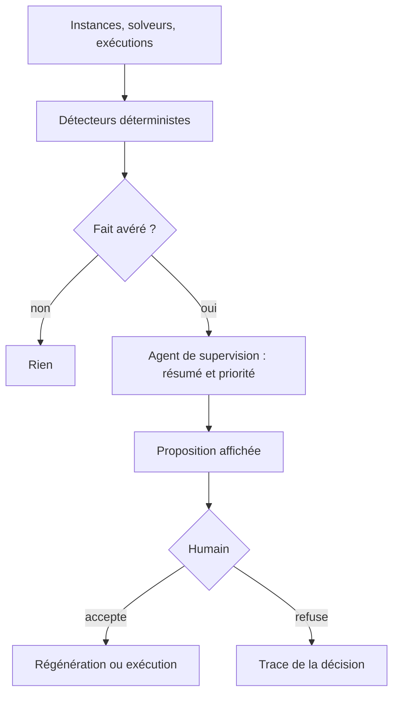

**Point d'architecture à corriger** 🟡 : il existe aussi un chemin où un LLM effectue lui-même la
détection (comparaisons de dates et d'identifiants). C'est un travail déterministe : le chemin LLM
devrait être retiré ou réduit à la seule mise en forme.

**Ce qui manque pour une vraie supervision** ⬜ : le système ne connaît pas l'avancement réel des
opérations. Sans retour d'atelier (début effectif, fin effective, panne), « prévu vs réel » reste
partiel. C'est la première dépendance à lever pour la V2.

---

## 15. Architecture de réoptimisation

**Mécanisme existant** ✅ : la replanification à horizon glissant. Toute opération du planning
précédent qui commence avant l'horizon gelé est **fixée** — même ressource, même début ; le reste
est réoptimisé librement.

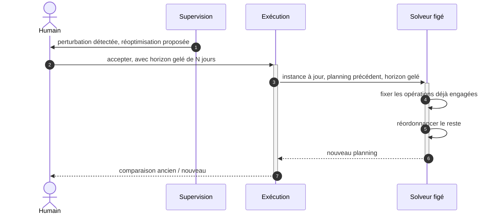

| Question | Réponse PRISME |
|---|---|
| Quand ? | Sur décision humaine, jamais automatiquement |
| Quelles données réinjectées ? | L'instance à jour + le planning précédent |
| Quelles contraintes conservées ? | Toutes, plus le gel des opérations engagées |
| Comment éviter de tout recalculer ? | L'horizon gelé : la partie déjà lancée n'est pas rediscutée |
| Comment comparer ? | Métriques de scénarios : makespan, retards, charge |

**Limite assumée** 🟡 : les solveurs figés avant l'introduction de ce paramètre ne le supportent pas.
Le système le dit explicitement plutôt que de replanifier tout en silence.

---

## 16. API

73 endpoints, 15 modules. Les principaux, par intention :

| Intention | Méthode et route | Entrée | Sortie | Erreurs |
|---|---|---|---|---|
| Ingérer un payload T-R-C-O | `POST /ingestion/{client_id}` | Instance JSON | `instance_id` | 422 payload invalide |
| Ingérer un CSV | `POST /adapters/csv/{client_id}` | Fichier + unité | `instance_id`, avertissements | 400 fichier illisible, 422 |
| Traduire des données brutes | `POST /adapters/comprehension/ingerer` | Données libres | Instance + justifications | 422, 503 LLM indisponible |
| Explorer une base | `POST /sources/explorer-bdd` | DSN lecture seule | Schéma + mapping proposé | 400 connexion |
| Générer un solveur, bloquant | `POST /generation/{instance_id}` | — | Résultat complet | 404, 409 déjà en cours |
| Générer, en tâche de fond | `POST /generation/{instance_id}/demarrer` | — | `job_id` | 404 |
| Suivre en direct | `GET /generation/jobs/{job_id}/stream` | — | Flux d'évènements | 404 |
| Relire une génération | `GET /generation/jobs/{job_id}/historique` | — | Tentatives, mesures, codes | 404 |
| Exécuter | `POST /execution/{instance_id}` | Horizon gelé éventuel | Planning + verdict | 404 solveur absent, 409 structure changée |
| Consulter un planning | `GET /planning/{execution_id}` | — | Planning + durées | 404 |
| Ajuster à la main | `POST /planning/{execution_id}/ajuster` | Opérations déplacées | Planning ou violations | 422 ajustement illégal |
| Ajouter une commande | `POST /ingestion/{instance_id}/commandes` | Gammes, quantités, date limite | `commande_id`, exécution best-effort | 404 gamme, 422 |
| Créer un scénario | `POST /ingestion/{instance_id}/scenarios` | Variante | `instance_id` du scénario | 422 |
| Comparer des scénarios | `GET /ingestion/{instance_id}/scenarios/comparaison` | — | Métriques comparées | 404 |
| Superviser | `POST /supervision/analyser` | — | Propositions | 503 |
| Trancher | `POST /supervision/propositions/{id}/decision` | Accepter ou refuser | Trace | 404, 409 déjà tranchée |
| Diagnostiquer | `POST /diagnostics/{execution_id}` | — | Cause attribuée | 404 |
| Auditer | `GET /audit/{execution_id}` | — | Code figé + documentation | 404 |

**Manques** ⬜ : aucun endpoint de simulation pure (« et si ? » sans persister), aucun endpoint
d'état système global (`/sante` existe côté supervision seulement), et pas de quota par client.

---

## 17. Structure du projet Python

La structure proposée dans la demande sépare `optimization/` et `solvers/`, ce qui n'a pas de sens
ici : il n'y a pas de moteur d'optimisation embarqué, mais une **fabrique** de solveurs et un
**exécuteur**. Structure réelle, conservée :

```text
prisme/
├── dsl/                  # modèle pivot : schema/, validation/, calendrier.py, examples/
├── adapters/             # anti-corruption : csv_import/, json_import/, greensig/,
│                         # erp_reference/, agent_comprehension/, dérivations
├── generation/           # fabrique de solveurs : graph.py, agents/, prompts/
├── validation_engine/    # cascade, faisabilité, banc synthétique, stabilité
├── solver_store/         # registre + artefacts figés
├── sandbox/              # exécution jetable : runner.py, container/
├── supervision/          # détecteurs + agent + orchestrateur
├── diagnostics/          # attribution de cause
├── estimation/           # durées estimées, optionnel
├── api/                  # routes/, etat.py, etat_postgres.py, input_validation/
├── scripts/              # outils de développement et démonstrations
├── tests/                # unit/ (50 fichiers), integration/ (35 fichiers)
└── docs/
```

Le seul ajout que je recommande : un paquet `observabilite/` si les mesures d'appels LLM dépassent
le périmètre de la génération — aujourd'hui elles vivent dans `generation/agents/client_llm.py`,
ce qui reste acceptable.

---

## 18. Séparation déterministe / IA

C'est la colonne vertébrale du projet.

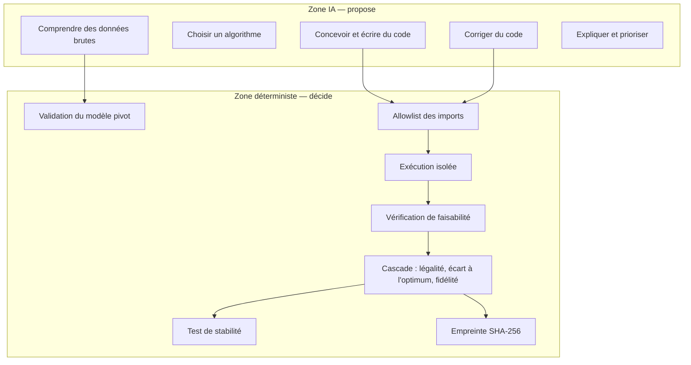

**Aucune sortie d'IA n'atteint un atelier sans passer par la zone déterministe.** Le corollaire
pratique : le pire qu'une hallucination puisse produire est un échec de génération, jamais un
planning invalide publié.

Cas limite honnête 🟡 : une hallucination **sémantique** de l'agent de compréhension — une
compatibilité inventée mais structurellement valide — passe la validation. Contre-mesures en place :
interdiction explicite dans le prompt, justification obligatoire par contrainte, avertissements
remontés à l'humain. Contre-mesure manquante ⬜ : un contrôle de vraisemblance croisé avec
l'historique réel de l'atelier.

---

## 19. Sécurité et validation

| Risque | Gravité | Parade | État |
|---|---|---|---|
| Exécuter du code généré par une IA | **Critique** | Conteneur jetable sans réseau ni écriture + allowlist AST + vocabulaire DSL borné | ✅ |
| Hallucination sémantique à l'ingestion | Élevée | Règles de prompt, justifications, avertissements, validation croisée | 🟡 |
| Données incorrectes ou manquantes | Élevée | Validation Pydantic, refus explicite, jamais de valeur par défaut inventée | ✅ |
| Contraintes incompatibles | Moyenne | Le solveur renvoie `None`, la supervision le signale | 🟡 |
| Planning infaisable publié | **Critique** | Garde-fou de faisabilité côté hôte après chaque exécution | ✅ |
| Altération d'un solveur figé | Élevée | Empreinte SHA-256 revérifiée à chaque relecture | ✅ |
| Connexion ERP interrompue | Moyenne | Lecture seule, échec explicite, jamais d'écriture côté client | ✅ |
| Appels multiples / concurrence | Moyenne | Limiteur d'appels LLM, jobs identifiés, idempotence de l'ingestion | 🟡 |
| Fuite entre clients | Élevée | Cloisonnement par `client_id` sur chaque route | 🟡 à auditer |
| Absence de traçabilité | Moyenne | Historique des générations, décisions humaines, canal d'audit | ✅ |
| Dérive de coût LLM | Moyenne | Mesure par appel, réflexion coupée, plafond de concurrence | 🟡 sans quota |

---

## 20. Stratégie de tests

Trois couches, parce qu'on ne teste pas du code généré comme du code écrit à la main.

| Couche | Objet | Méthode | État |
|---|---|---|---|
| 1 | Code écrit à la main | Tests unitaires et d'intégration classiques | ✅ 85 fichiers |
| 2 | Code généré | Jugé sur les **propriétés du planning produit** : légalité, écart à un optimum connu par construction, fidélité à des cas de référence | ✅ |
| 3 | La génération elle-même | N générations sur la même instance, plannings équivalents attendus | ✅ |

Compléments par domaine : connecteurs (jeux de fichiers réels et dégradés), agents (faux modèle,
aucun appel réseau), modèle pivot (cas limites de validation), sandbox (test de sécurité prouvant
l'isolation seule), réoptimisation (horizon gelé respecté), Postgres et Docker (ignorés proprement
si indisponibles).

**Jeux de données synthétiques** : le banc construit à l'envers autour d'un planning optimal connu
(1 à 80 tâches), six secteurs de démonstration dans l'ERP de référence, et trois exports bruts
volontairement hostiles — dont un sans aucune durée, avec routage flexible et identités de tâches
ambiguës.

**Manques** ⬜ : aucun test de charge (instance de plusieurs milliers de tâches), aucun test de
non-régression sur les prompts (une modification de prompt n'est validée que par une génération
réelle, coûteuse).

---

## 21. MVP

Ce qui est nécessaire pour démontrer la thèse du projet — **et qui existe déjà** :

| Élément | Pourquoi indispensable |
|---|---|
| Modèle pivot + validation | Sans lui, rien n'est vérifiable |
| Un connecteur déterministe | Prouve qu'on part de données réelles |
| Pipeline de génération borné | C'est la thèse : l'IA écrit le solveur |
| Cascade de validation | C'est ce qui rend la thèse défendable |
| Registre + sandbox | Prouve « générer une fois, réexécuter souvent » et la sécurité |
| Exécution + garde-fou | Produit le livrable métier : un planning légal |
| Supervision minimale | Prouve le human-in-the-loop |

## 22. V2

| Élément | Pourquoi ensuite |
|---|---|
| Retour d'atelier sur l'avancement réel | Condition d'une vraie supervision « prévu vs réel » |
| Réoptimisation assistée par événement | Nécessite le point précédent |
| Connecteurs MySQL et SQL Server | Simple réplication du patron existant |
| Oracle exact hors ligne | Renforcerait la mesure de qualité |
| Quotas et coûts par client | Nécessaire dès qu'il y a plusieurs clients réels |
| Estimation de durées sur données réelles | Aujourd'hui entraînée sur du synthétique |
| Tests de charge | Valider le passage à l'échelle annoncé |

## 23. Hors périmètre

| Élément | Pourquoi non |
|---|---|
| BPMN | Besoin jamais confirmé ; l'effort serait considérable |
| Ordonnancement temps réel à la seconde | Le FJSP visé est à l'échelle de la journée ou de l'heure |
| Optimisation multi-sites, coûts, marges | Ce n'est plus du FJSP |
| Écriture dans l'ERP client | Risque disproportionné pour un démonstrateur |
| Haute disponibilité, montée en charge, cloud | Démonstrateur, pas produit |
| Nomenclature / BOM automatique | Reporté explicitement en v1 |
| Réoptimisation autonome sans humain | Contraire au principe fondateur |

---

## 24. Scénario complet de référence

**Atelier** : quatre machines, deux opérateurs, compétences distinctes. Trois commandes arrivent.
Chaque commande explose en opérations via sa gamme. Certaines opérations passent sur plusieurs
machines compatibles, avec des durées différentes. Une machine est indisponible le mercredi. Une
commande est prioritaire.

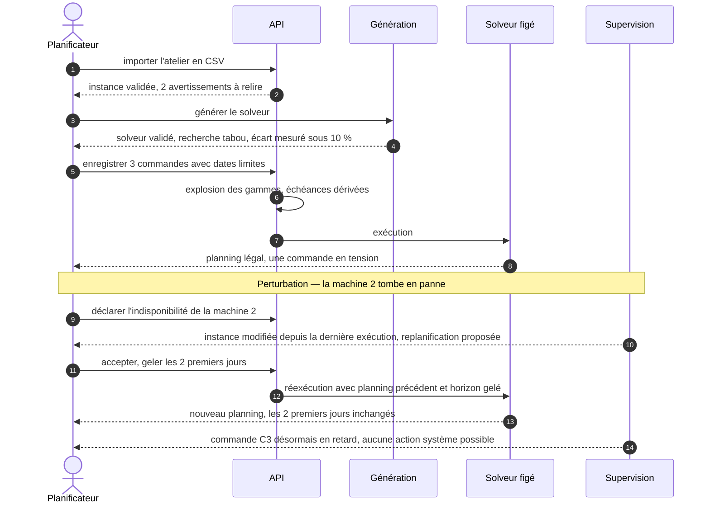

**Ce que le scénario démontre** : aucun appel à l'IA après la génération initiale ; la perturbation
est absorbée par le même code figé ; l'humain décide du gel et accepte la replanification ; le
retard résiduel est signalé honnêtement plutôt que masqué.

**Ce qu'il révèle comme limite** 🟡 : la panne doit être **déclarée** par un humain. Sans retour
d'atelier automatique, la détection dépend de la saisie.

---

## 25. Décisions d'architecture à prendre

| # | Décision | Options | Recommandation |
|---|---|---|---|
| D1 | Moteur exact | Aucun / oracle hors ligne / retour en production | Oracle hors ligne uniquement |
| D2 | Détection de supervision | Déterministe seule / LLM / mixte actuel | Déterministe seule, LLM pour la mise en forme |
| D3 | Réoptimisation | Proposée / automatique sous conditions | Rester sur proposée |
| D4 | Retour d'atelier | Aucun / saisie manuelle / connecteur MES | Saisie manuelle en V2, connecteur au-delà |
| D5 | Modèle LLM par agent | Un seul / par agent | Par agent, déjà possible, à calibrer par la mesure |
| D6 | Stratégie de coût | Aucune / quota par client | Quota dès le deuxième client réel |
| D7 | Versionnage des prompts | Implicite via git / explicite avec numéro de version stocké | Explicite : un solveur devrait tracer la version de prompt qui l'a produit |
| D8 | Politique de rétention | Non définie | À définir avant tout client réel |

---

## 26. Questions à trancher avant la suite

### P0 — bloquant

1. **Le retour d'atelier existera-t-il ?** Sans lui, la supervision « prévu vs réel » reste une
   comparaison entre un planning et des déclarations manuelles. Cela conditionne V2 entière.
2. **Le démonstrateur doit-il tourner chez un client réel pendant le PFE ?** Si oui, quotas,
   rétention et isolation deviennent bloquants ; sinon ils restent en V2.
3. **Assumes-tu définitivement l'absence de moteur exact ?** La réponse change ce qu'on peut
   affirmer en soutenance sur la qualité des plannings.
4. **Quel volume réel doit être supporté ?** Le budget d'exécution de 30 secondes n'a de sens que
   rapporté à une taille d'instance cible.

### P1 — important

5. Quels ERP réels seront branchés au-delà de GreenSIG ?
6. Le chemin de détection par LLM dans la supervision doit-il être retiré ?
7. Quelle est la politique de régénération : à chaque changement de structure, ou sur seuil ?
8. Faut-il tracer la version de prompt ayant produit chaque solveur figé ?
9. L'estimation de durées doit-elle rester active alors qu'elle est entraînée sur du synthétique ?

### P2 — amélioration

10. Faut-il un endpoint de simulation pure, sans persistance ?
11. Faut-il exposer les mesures de latence des agents d'ingestion, comme pour la génération ?
12. Faut-il un tableau de bord de coût LLM par client ?
13. Faut-il réactiver l'agent Reviewer, mesure à l'appui ?

---

## Annexe — état d'avancement synthétique

| Étape | Contenu | État |
|---|---|---|
| 1 | Modèle pivot T-R-C-O | ✅ |
| 2 | Vérificateur de faisabilité | ✅ |
| 3 | Banc synthétique à optimum connu | ✅ |
| 4 | Générateur en un coup | ✅ |
| 5 | Cascade de validation | ✅ |
| 6 | Boucle de génération-test-réparation | ✅ |
| 7 | Registre + bac à sable | ✅ |
| 8 | API + adaptateurs | ✅ |
| 9 | Tableau de bord et supervision avancée | 🟡 |
| — | Frontend d'exploitation | ✅ |
| — | Retour d'atelier et réoptimisation événementielle | ⬜ |
